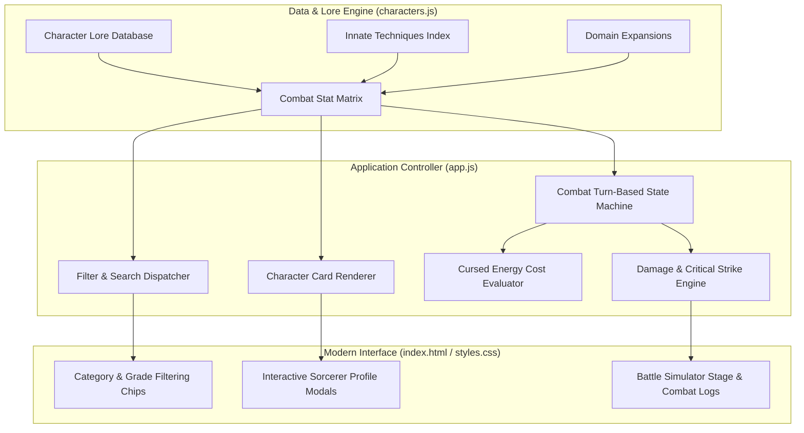

<div align="center">

# 🌌 JUJUTSU KAISEN COMPANION
### Interactive Character Archive, Cursed Technique Analyzer & Tactical Battle Engine

[](https://developer.mozilla.org/en-US/docs/Web/JavaScript)
[](https://developer.mozilla.org/en-US/docs/Web/HTML)
[](https://tailwindcss.com/)
[](https://github.com/harinarayana1457-cmyk/jjk-companion)
[](https://opensource.org/licenses/MIT)

<p align="center">
  The ultimate tactical companion and lore registry for <b>Jujutsu Kaisen</b> sorcerers and fans. Explore exhaustive grade hierarchies, analyze cursed energy thresholds, inspect signature Domain Expansions, and simulate turn-based combat encounters in a lightweight zero-dependency web app.
</p>

[✨ Core Features](#-core-features) • [🏛️ Architecture](#-system-architecture) • [🎮 Battle Engine](#-tactical-battle-engine) • [🚀 Quickstart](#-quickstart-guide) • [📁 Project Structure](#-project-structure)

</div>

---

## 🌟 Core Features

* **📜 Jujutsu High Archive**: Comprehensive character encyclopedia detailing combat grades (Special Grade down to Grade 4), innate techniques, cursed tool proficiencies, and canonical character backgrounds.
* **⚡ Cursed Energy Analysis Terminal**: Interactive evaluator visualizing cursed energy reserve meters, output efficiency, and innate trait classifications.
* **⛩️ Domain Expansion Visualizer**: Detailed database of lethal and non-lethal domains (Unlimited Void, Malevolent Shrine, Chimera Shadow Garden) with barrier properties and sure-hit parameters.
* **🎮 Turn-Based Combat Simulator**: Select sorcerers (Gojo, Sukuna, Megumi, Yuji, Nanami), manage cursed energy points (CE), deploy tactical abilities, and clash against high-tier cursed spirits.
* **⚡ Zero-Server Architecture**: Pure client-side application — lightning-fast load times with zero backend dependencies.

---

## 🏛️ System Architecture



---

## 🎮 Tactical Battle Engine

The built-in turn-based simulation engine lets you pit your favorite characters in combat:
1. **Choose Combatants**: Pick your Sorcerer and target Cursed Spirit.
2. **Resource Management**: Each attack consumes Cursed Energy (CE). Balance basic physical strikes with heavy technique costs.
3. **Domain Expansion**: Trigger ultimate Domain moves when energy thresholds are reached to activate sure-hit mechanics.
4. **Dynamic Combat Log**: Real-time combat telemetry tracks hits, misses, damage multipliers, and status conditions.

---

## 🚀 Quickstart Guide

### 1. Clone the Repository
```bash
git clone https://github.com/harinarayana1457-cmyk/jjk-companion.git
cd jjk-companion
```

### 2. Launch the Application
No server or build dependencies are required! Simply open the file:
* **Direct Browser Launch**: Double-click `index.html` or open it with your web browser.
* **Local Live Server (Optional)**:
  ```bash
  # Using Python built-in server
  python -m http.server 8000

  # Or using npx serve
  npx serve .
  ```
Visit `http://localhost:8000` in your web browser.

---

## 📁 Project Structure

```text
jjk-companion/
├── index.html                # Semantic HTML5 layout shell & UI templates
├── app.js                    # UI event handling, filter engine & combat state machine
├── characters.js             # Comprehensive dataset of sorcerers, curses & techniques
├── styles.css                # Dark supernatural aesthetic styling & animations
├── .gitignore                # Repository ignore rules
└── README.md                 # Project documentation
```

---

## 🤖 Built with Google Antigravity SDK

This project was prototyped and developed leveraging the **Google Antigravity SDK**, demonstrating autonomous multi-agent code orchestration, domain lore contextual reasoning, and zero-dependency web application generation.

---

## 📄 License

* Distributed under the **MIT License**.
* Developed by **[Hari Narayana (@harinarayana1457-cmyk)](https://github.com/harinarayana1457-cmyk)**.
* Jujutsu Kaisen characters, lore, and universe are the intellectual property of Gege Akutami / Shueisha.
